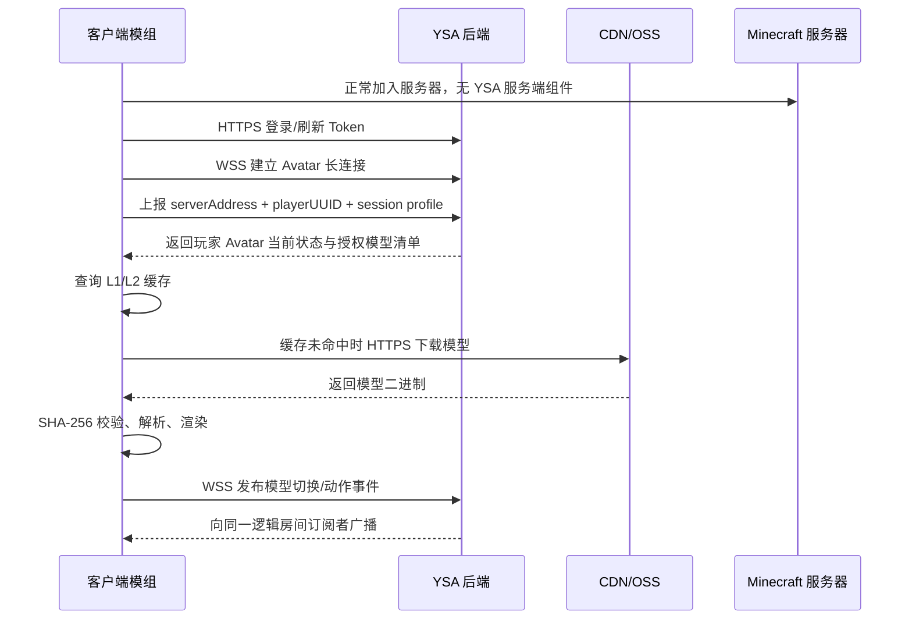
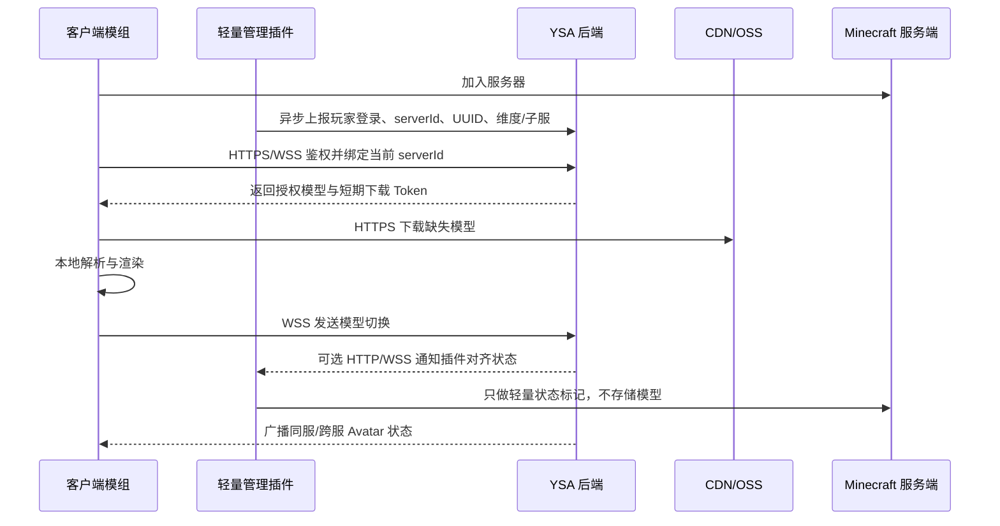

# Yes Steve Avatar 分布式数字身份系统重构计划书

## 0. 评估结论

Yes Steve Avatar 的正确工程目标不是把 OpenYSM 的所有服务端逻辑“魔法式搬到云端”，而是把当前服务端承担的三类职责拆开：

1. **资产仓库与大文件分发**：可以迁移到独立后端 + OSS/S3 + CDN。
2. **玩家 Avatar 身份与授权状态**：可以迁移到独立后端，由客户端和可选管理插件共同访问。
3. **Minecraft 运行时状态**：例如同服可见性、实体追踪、维度、载具、投射物、血量、药水、输入、服务端 Molang 变量等，不能在完全无服务端组件的条件下可靠获得。

因此系统必须定义两种运行模式：

| 模式 | 服务端改动 | 能力范围 | 适用场景 |
|:---|:---|:---|:---|
| **Zero-Server 公共服模式** | 无需安装任何插件 | 客户端本地 Avatar、中心化账号模型、好友/全局房间状态、有限的模型切换展示 | 正版大服、无插件权限服务器 |
| **Bridge 完整功能模式** | 安装轻量 Velocity/Paper/Spigot 管理插件 | 同服广播、跨服跟随、权限指令、可信在线状态、与 LuckPerms 对齐 | 自建服、群组服、商业服 |

“服务端 TPS 爆炸半径为 0”只在 **Zero-Server 公共服模式** 下成立，因为 Minecraft 服务端确实不加载任何 YSA 组件。但该模式下功能也必须降级。若启用管理插件，TPS 风险不是 0，而是通过“无资产存储、无核心计算、全异步 HTTP、限流熔断”降低到极低。

---

## 1. 现有单体架构痛点分析

### 1.1 SPOF 与 Worker 雪崩

OpenYSM(或 YSM) 当前服务端承担模型扫描、缓存、加密握手、分片传输、授权校验和状态广播。源码中 `ServerModelManager` 直接管理：

- `config/yes_steve_model/built`
- `config/yes_steve_model/custom`
- `config/yes_steve_model/auth`
- `config/yes_steve_model/export`
- `config/yes_steve_model/cache/server`
- `config/yes_steve_model/cache/client`

一旦模型加载、缓存生成、分片发送、加密转码或玩家同步出现 OOM、阻塞或异常，故障域会直接扩散到 Minecraft 服务端。对于 200+ 在线的大型网络服，这种架构会把模型系统的 I/O、CPU、内存、GC 压力全部压到游戏核心进程。

### 1.2 游戏主线程与网络队列被挤占

当前 `NetworkHandler` 注册了大量 Minecraft 自定义 Packet：

- 模型同步：`S2CModelSyncPayload`、`C2SModelSyncPayload`
- 模型切换：`C2SRequestSwitchModelPacket`、`S2CSetModelAndTexturePacket`
- 授权同步：`S2CSyncAuthModelsPacket`
- 动画与 Molang：`C2SPlayAnimationPacket`、`C2SRequestExecuteMolangPacket`、`C2SSyncAnimationExpressionPacket`
- 玩家状态：`S2CSyncPlayerStatePacket`
- 投射物/载具：`S2CSyncProjectileModelPacket`、`S2CSyncVehicleModelPacket`
- 上传链路：`C2SModelUploadStartPacket`、`C2SModelUploadChunkPacket`、`C2SModelUploadFinishPacket`

服务端还会在 tick 阶段遍历玩家 Capability，判断 dirty 状态并广播同步包。即使部分工作已放入异步线程，最终仍会占用 Minecraft 网络队列、连接缓冲区和服务端状态机。

### 1.3 资产版权漏洞

当前服务端拥有完整模型文件和缓存文件。开服主或拥有文件系统权限的人可以直接复制、导出或二次分发。

更重要的是，客户端侧也存在导出风险。只要客户端完成握手并获得缓存解密能力，就可以从本地缓存还原模型。因此版权保护不能承诺“绝对不可复制”，只能设计为：

- 服务端侧物理隔离，禁止开服主直接接触模型文件。
- 客户端短期授权下载，减少无授权批量抓取。
- Hash 首发注册，防止平台内盗刷覆盖。
- 水印与审计追责，提升泄露成本。

### 1.4 跨服状态分裂

现有授权和模型状态绑定在单个服务端玩家 Capability 内。群组服切服后，如果没有中心化状态仓库或 Velocity 桥接层，状态会丢失或需要重复同步。Yes Steve Avatar 应把玩家 Avatar 状态迁移为“云端身份状态”，由客户端和可选管理插件共同读取。

---

## 2. 全新分布式网络协议设计

### 2.1 协议分工

| 维度 | HTTPS + CDN | WSS | Minecraft Packet |
|:---|:---|:---|:---|
| 适合内容 | `.ysm`、`.bbmodel`、贴图、元数据、上传下载 | 模型切换、在线状态、姿态、动作事件 | 原版游戏状态、实体追踪、服务端可信事件 |
| 连接形态 | 请求-响应，天然适合缓存 | 全双工长连接 | 依附游戏连接 |
| CDN 兼容 | 极佳 | 受 CDN/WebSocket 支持限制 | 不适合 |
| 大文件效率 | 支持 Range、ETag、断点续传 | 不适合大文件 | 会挤占游戏网络 |
| 实时广播 | 不适合 | 适合 | 可行但影响游戏链路 |

设计决策：

- **大文件资产分发走 HTTPS + CDN**：资产是“一次下载，多次复用”的静态对象，适合 CDN 缓存、Range 断点续传、ETag 校验和边缘限流。
- **高频状态同步走 WSS**：模型切换、姿态广播、动作事件属于小包高频、低延迟、服务端主动推送场景。
- **Minecraft Packet 只在 Bridge 模式保留最小状态桥**：用于可信服务器状态，不再承载模型大文件。

### 2.2 玩家进服到模型渲染的全异步流程

#### Zero-Server 公共服模式



TPS 影响：Minecraft 服务端没有安装组件，资产下载、WSS、缓存、解析均在客户端和独立后端完成，对主服务器 TPS 的直接爆炸半径为 0。

限制：后端无法可信知道“真实同服可见玩家集合”，只能基于客户端上报的 serverAddress、好友关系、全局房间或近似分组广播。

#### Bridge 完整功能模式



TPS 影响：插件不处理模型文件、不做压缩/加密/解析、不走 Minecraft 大文件 Packet，仅做异步 HTTP 和少量状态缓存。风险来自登录事件、命令事件和少量状态同步，需通过超时、线程池、熔断和限流控制。

---

## 3. 四件套组件技术规格与核心逻辑

### 3.1 客户端模组

#### 技术规格

| 项目 | 规格 |
|:---|:---|
| 加载器 | Fabric / NeoForge |
| Minecraft | 26.x |
| 后端地址 | 默认 `ysm.aihmc.top`，GUI 可修改 |
| 协议约束 | 强制 HTTPS/WSS，拒绝 HTTP/WS |
| 缓存 | L1 内存、L2 磁盘、L3 CDN |
| Hash | SHA-256 |
| 下载 | HTTPS Range + ETag + Token |
| 上传 | HTTPS multipart 或分片上传 |
| 渲染 | 保留本地模型解析、Molang、GPU/CPU 渲染管线 |

#### 缓存判别逻辑

```java
CompletableFuture<ModelData> resolveModel(ModelMeta meta, AuthToken token) {
    String hash = meta.sha256();

    ModelData mem = l1Cache.getIfPresent(hash);
    if (mem != null) {
        return completedFuture(mem);
    }

    Path disk = cacheRoot.resolve(hash + ".ysm");
    if (Files.exists(disk) && sha256(disk).equals(hash)) {
        return parseAsync(disk).thenApply(model -> {
            l1Cache.put(hash, model);
            return model;
        });
    }

    return downloadAsync(meta.downloadUrl(), token, hash)
        .thenCompose(path -> parseAsync(path))
        .thenApply(model -> {
            l1Cache.put(hash, model);
            return model;
        });
}
```

#### HTTPS 下载伪代码

```java
CompletableFuture<Path> downloadAsync(URI url, AuthToken token, String sha256) {
    return CompletableFuture.supplyAsync(() -> {
        Path tmp = cacheRoot.resolve(sha256 + ".part");
        long offset = Files.exists(tmp) ? Files.size(tmp) : 0L;

        HttpRequest.Builder builder = HttpRequest.newBuilder(url)
            .header("Authorization", "Bearer " + token.value())
            .header("Accept", "application/octet-stream")
            .timeout(Duration.ofSeconds(30))
            .GET();

        if (offset > 0) {
            builder.header("Range", "bytes=" + offset + "-");
        }

        HttpResponse<InputStream> resp = http.send(builder.build(), BodyHandlers.ofInputStream());
        if (resp.statusCode() != 200 && resp.statusCode() != 206) {
            throw new IOException("download failed: HTTP " + resp.statusCode());
        }

        appendStream(tmp, resp.body());
        if (!sha256(tmp).equals(sha256)) {
            Files.deleteIfExists(tmp);
            throw new SecurityException("SHA-256 mismatch");
        }

        Path finalFile = cacheRoot.resolve(sha256 + ".ysm");
        Files.move(tmp, finalFile, ATOMIC_MOVE, REPLACE_EXISTING);
        return finalFile;
    }, YSA_IO_POOL);
}
```

#### HTTPS 上传伪代码

```java
CompletableFuture<UploadResult> uploadModel(Path file, String modelId, AuthToken token) {
    return CompletableFuture.supplyAsync(() -> {
        String hash = sha256(file);
        UploadInit init = api.postJson("/api/v1/uploads/init", Map.of(
            "modelId", modelId,
            "sha256", hash,
            "size", Files.size(file)
        ), token);

        for (Chunk chunk : split(file, init.chunkSize())) {
            api.putBytes(init.uploadUrl(chunk.index()), chunk.bytes(), token);
        }

        return api.postJson("/api/v1/uploads/complete", Map.of(
            "uploadId", init.uploadId(),
            "sha256", hash
        ), token);
    }, YSA_IO_POOL);
}
```

### 3.2 后端核心

#### 推荐技术栈

MVP 推荐 **Go 单体模块化服务**，后续再拆微服务。原因：

- Goroutine 和 channel 适合 WSS 连接池。
- 单二进制部署简单，适合轻量云 VPS。
- 静态资源 API、JWT、S3/OSS SDK、Prometheus 指标生态成熟。
- 避免过早引入 Go + Node.js 异构运维复杂度。

#### 模块划分

| 模块 | 职责 |
|:---|:---|
| `auth` | 登录、Token 签发、刷新、吊销 |
| `models` | 模型元数据、Hash 唯一、作者绑定、版本管理 |
| `storage` | OSS/S3 对接、预签名 URL、CDN 刷新 |
| `ws` | WSS 连接池、房间、广播、心跳 |
| `admin` | 管理 API、审核 API、权限 API |
| `bridge` | 可选插件上报、serverId、LuckPerms 映射 |
| `audit` | 操作审计、上传审计、水印追踪记录 |

#### WSS 连接池策略

```go
type Client struct {
    Conn       *websocket.Conn
    UserID     string
    PlayerUUID string
    ServerID   string
    Send       chan Event
    LastSeen   time.Time
}

type Hub struct {
    Clients    map[string]*Client
    Rooms      map[string]map[string]*Client
    Register   chan *Client
    Unregister chan *Client
    Broadcast  chan Event
}

func (h *Hub) Run() {
    for {
        select {
        case c := <-h.Register:
            h.Clients[c.PlayerUUID] = c
            h.joinRoom(resolveRoom(c), c)
        case c := <-h.Unregister:
            h.remove(c)
        case e := <-h.Broadcast:
            for _, c := range h.Rooms[e.RoomID] {
                select {
                case c.Send <- e:
                default:
                    h.remove(c)
                }
            }
        }
    }
}
```

关键策略：

- 每连接独立读写 goroutine。
- `Send` channel 设置上限，慢客户端直接断开。
- 心跳周期 15s，超时 45s。
- 广播按 `serverId`、`partyId`、`friendRoom` 或 `publicServerHash` 分房间。
- 动作事件使用合并策略：同一玩家姿态包可丢旧保新，模型切换包不可丢。
- 所有客户端事件必须校验 Token、UUID、速率和事件类型。

### 3.3 管理后台

#### 技术规格

| 项目 | 规格 |
|:---|:---|
| 框架 | React 或 Vue3 |
| 样式 | Tailwind CSS |
| 鉴权 | OAuth2/OIDC 或平台统一通行证 |
| 上传 | 分片上传、断点续传、Hash 秒传 |
| 审核 | 人工审核 + 自动 Hash/格式/体积检测 |
| 权限 | 创作者、审核员、管理员、服主 |

#### 核心页面

- 模型列表：状态、版本、Hash、作者 UUID、下载量、审核状态。
- 上传向导：本地 Hash 预校验、元数据编辑、版权声明。
- 授权管理：玩家 UUID、模型授权、过期时间、来源。
- 审核工作台：重复 Hash、疑似盗传、模型预览、驳回理由。
- 审计日志：上传、授权、删除、下载 Token 签发、管理员操作。

### 3.4 管理插件

#### 定位

管理插件不是核心模组，不存模型、不解析模型、不参与渲染。它只是可信服务端上下文桥：

- 上报玩家登录/退出/切服。
- 提供 `/ysm` 管理指令。
- 对接 LuckPerms。
- 将命令异步转发到后端。
- 在 Velocity 场景维护短 TTL 的跨服状态缓存。

#### LuckPerms 权限节点

```text
ysmavatar.admin
ysmavatar.model.reload
ysmavatar.model.set
ysmavatar.model.disable
ysmavatar.auth.add
ysmavatar.auth.remove
ysmavatar.auth.all
ysmavatar.auth.clear
ysmavatar.ping
```

#### `/ysm model reload` 降级为 HTTP API

```java
CompletableFuture<AdminResult> reloadModels(CommandSender sender) {
    if (!sender.hasPermission("ysmavatar.model.reload")) {
        return completedFuture(AdminResult.denied());
    }

    JsonObject body = new JsonObject();
    body.addProperty("serverId", config.serverId());
    body.addProperty("operator", sender.getName());
    body.addProperty("timestamp", System.currentTimeMillis());

    HttpRequest req = HttpRequest.newBuilder()
        .uri(URI.create(config.backendUrl() + "/api/v1/admin/models/reload"))
        .header("Content-Type", "application/json")
        .header("X-Server-Id", config.serverId())
        .header("X-Server-Secret", config.serverSecret())
        .timeout(Duration.ofSeconds(3))
        .POST(BodyPublishers.ofString(body.toString()))
        .build();

    return httpClient.sendAsync(req, BodyHandlers.ofString())
        .thenApply(resp -> parseAdminResult(resp.body()))
        .exceptionally(ex -> AdminResult.failed("backend unavailable"));
}
```

#### 插件线程模型

- 所有 HTTP 请求必须使用异步 HttpClient。
- 主线程只做命令解析和最终消息回显。
- 每个 API 设置 2-3 秒超时。
- 后端不可用时快速失败，不阻塞玩家登录。
- Velocity 缓存 TTL 建议 5-15 秒，只缓存状态摘要，不缓存资产。

---

## 4. 资产版权保护设计

### 4.1 物理隔离边界

资产链路改为：

```text
创作者客户端/管理后台
  -> HTTPS 上传
  -> YSA 后端审核与 Hash 注册
  -> OSS/S3 私有桶
  -> CDN 带签名 URL
  -> 授权客户端 HTTPS 下载
  -> 本地加密缓存与渲染
```

Minecraft 服务端在该链路中不再接触模型二进制。即使服主拥有服务端文件系统权限，也无法从 `config/yes_steve_model` 拿到模型文件，因为服务端不再是模型仓库。

### 4.2 首发 UUID 防覆盖

规则：

1. `modelId` 首次注册后绑定作者 UUID。
2. 同一 `sha256` 全局唯一，重复上传进入“引用/授权”流程，不允许伪装成新原创。
3. 更新模型必须由原作者或授权团队成员签名。
4. 后台审核记录上传 IP、账号、UUID、Hash、时间戳。
5. 争议模型进入冻结态，停止新授权和公开分发。

伪代码：

```go
func RegisterModel(req RegisterRequest, user User) error {
    if existsHash(req.SHA256) {
        return ErrDuplicateHash
    }

    existing := findByModelID(req.ModelID)
    if existing != nil && existing.AuthorUUID != user.UUID {
        return ErrModelIDOwned
    }

    if existing != nil && !VerifySignature(req.SHA256, req.Signature, user.PublicKey) {
        return ErrInvalidSignature
    }

    return tx.InsertModel(Model{
        ModelID: req.ModelID,
        AuthorUUID: user.UUID,
        SHA256: req.SHA256,
        Status: "pending_review",
    })
}
```

### 4.3 必须承认的版权边界

客户端最终必须获得可渲染数据，因此无法从技术上绝对防止恶意客户端提取。可执行目标应写为：

- 防止服务端侧直接复制。
- 防止平台内盗传覆盖。
- 防止无 Token 批量下载。
- 支持泄露追踪和证据固化。
- 提高盗取成本，而非宣称不可复制。

---

## 5. Vibe Coding 研发与部署里程碑

### Phase 0：源码协议审计与边界确认，1-2 周

产出：

- `ProtocolInventory.md`：列出所有现有 Packet、方向、载荷、是否迁移。
- `CapabilityStateMap.md`：列出玩家模型、授权、Molang、投射物、载具状态来源。
- `ZeroServerLimitations.md`：明确零服务端模式降级功能。
- `MigrationRisk.md`：法律、版权、安全、性能风险。

AI 辅助方式：

- 根据反编译源码生成 Packet 表。
- 根据调用图总结状态同步路径。
- 人工复核服务端可信状态边界。

### Phase 1：后端 MVP，2-4 周

产出：

- Go 后端服务。
- PostgreSQL Schema。
- JWT/Session Token。
- 模型元数据 API。
- OSS/S3 私有桶接入。
- 预签名下载 URL。
- Prometheus 指标。

验收：

- 可上传模型。
- 可按 Hash 秒传。
- 可签发短期下载 URL。
- 可拒绝重复 Hash 与 modelId 抢占。

### Phase 2：客户端 HTTPS 缓存下载，3-5 周

产出：

- 后端地址配置 GUI，默认 `ysm.aihmc.top`。
- 协议强制器：HTTP -> HTTPS，WS -> WSS，禁止明文。
- L1/L2/L3 缓存管理器。
- HTTPS Range 下载器。
- Token 刷新逻辑。
- 与现有模型解析/渲染管线对接。

验收：

- 首次进入可下载模型。
- 二次进入命中 L2 缓存。
- Hash 不一致时删除缓存并重下。
- 后端不可用时不影响进入 Minecraft 服务器，只回退默认模型。

### Phase 3：WSS 管道，2-3 周

产出：

- WSS Hub。
- 心跳、重连、限流。
- 房间模型：公共服房间、好友房间、Bridge serverId 房间。
- 模型切换事件广播。

验收：

- 1,000 连接压测稳定。
- 慢客户端可被剔除。
- 模型切换消息 p95 延迟可观测。

### Phase 4：管理后台，2-3 周

产出：

- 上传页面。
- 模型管理页。
- 审核工作台。
- UUID 绑定与授权页。
- 审计日志页。

验收：

- 创作者可上传并提交审核。
- 管理员可通过/驳回。
- 玩家授权可查询和修改。

### Phase 5：可选管理插件，1-2 周

产出：

- Velocity 插件。
- Paper/Spigot 插件。
- LuckPerms 权限节点。
- `/ysm auth`、`/ysm model`、`/ysm ping`。
- 异步 HTTP API 客户端。

验收：

- 后端离线不阻塞主线程。
- 命令能正确返回成功/失败。
- 群组服切服后 Avatar 状态可跟随。

### Phase 6：监控、压测与灰度，2 周

产出：

- Prometheus + Grafana 或 Zabbix 统一监控。
- WSS 连接数、广播延迟、断线率。
- CDN 命中率、下载失败率。
- 上传失败率、审核队列长度。
- API p95/p99 延迟。

验收：

- 50/100/500/1000 连接阶梯压测。
- CDN 回源可控。
- 后端重启客户端可自动重连。
- 灰度环境可回滚。

---

## 6. 最终可执行建议

第一版不要追求“一步到位完全去服务端化”。推荐路线：

1. 先迁移模型资产仓库和大文件传输。
2. 保留 OpenYSM 成熟的本地解析、渲染、Molang 管线。
3. 将 Zero-Server 模式定义为公开服兼容模式，接受功能降级。
4. 将 Bridge 插件定义为完整体验增强组件，而不是核心资产组件。
5. 版权保护目标从“彻底防复制”调整为“服务端隔离 + 平台防盗刷 + 授权下载 + 审计追责”。

这样才能同时满足：

- 正版大服可用。
- 自建服体验完整。
- Minecraft 主服务器不再承载模型大文件压力。
- 创作者资产不再暴露给开服主文件系统。
- 工程上可以分阶段交付，而不是一次性重写全部系统。

---

> **文档版本：** v1.0  
> **最后更新：** 2026-06-12  
> **作者：** AIH-MC 开发团队
